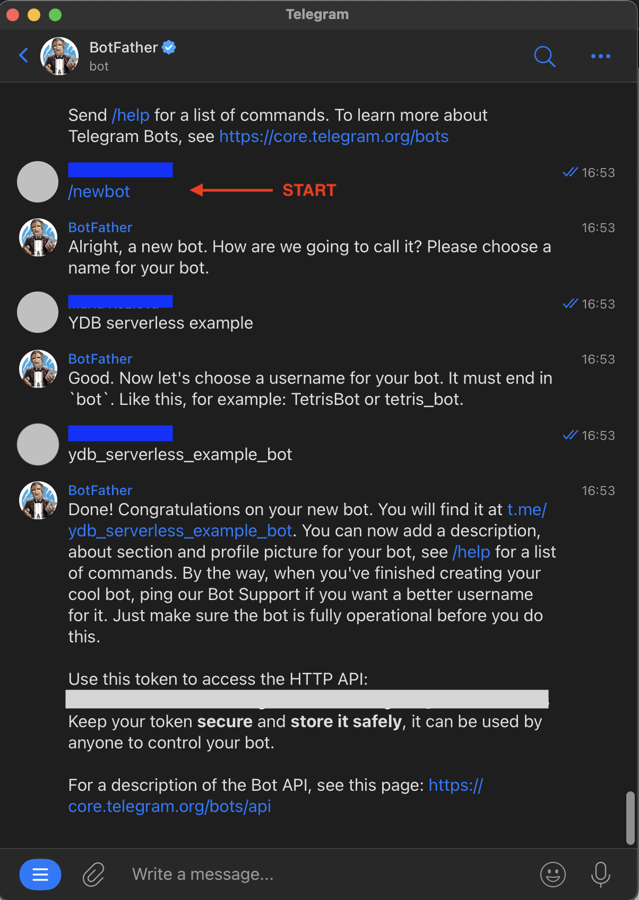
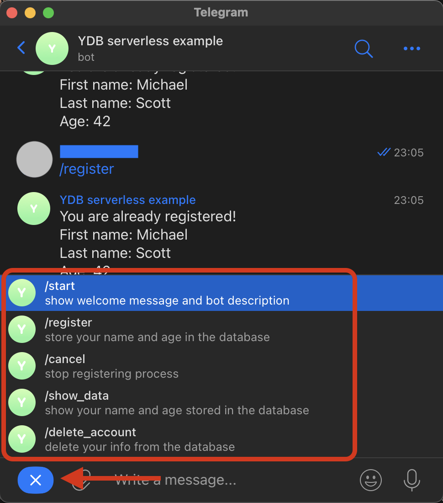
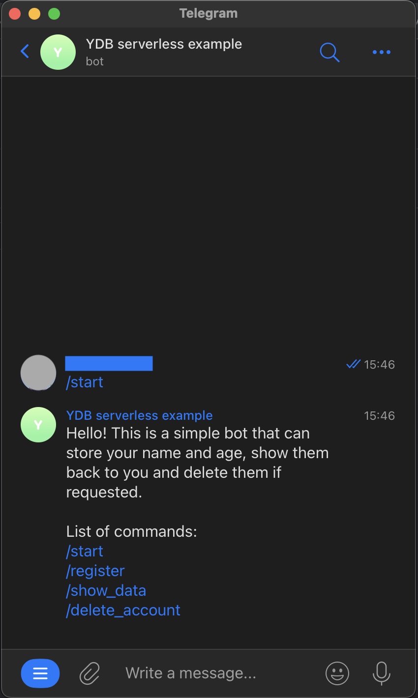
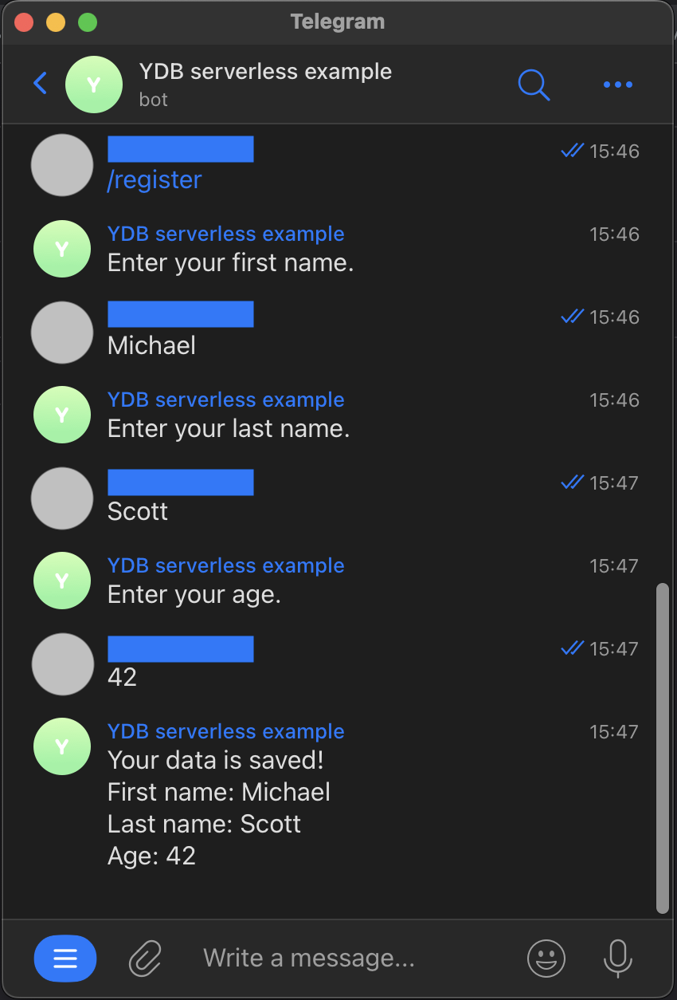
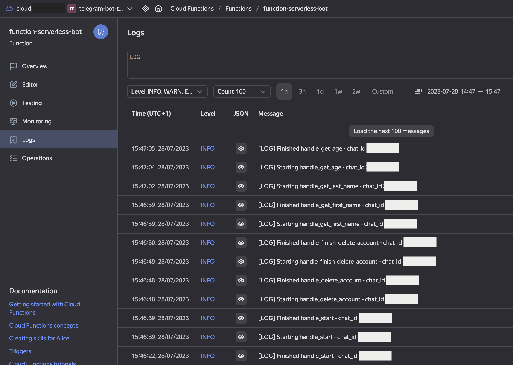
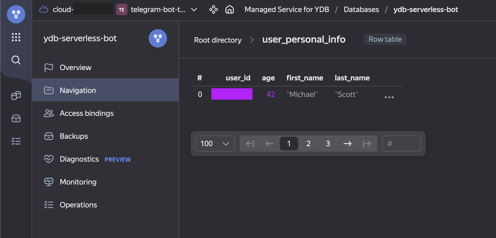

# About
This is a simple example of a telegram bot implementation. This code is designed to be run on [Yandex Cloud Serverless Function](https://cloud.yandex.com/en/docs/functions/quickstart/?from=int-console-help-center-or-nav) connected to [YDB database](https://cloud.yandex.com/en/docs/ydb/quickstart?from=int-console-help-center-or-nav) using [TeleBot (pyTelegramBotAPI)](https://pytba.readthedocs.io/en/latest/index.html) python3 package.

## Advantages

This repository can be used as a template for creating more complicated bots.

This implementation supports:
- full logging adapted to Yandex Cloud Functions
- handling user's states, which allows to conveniently process each text input in appropriate context and make complicated logics manageable
- handling a variety of Reply Keyboards and simple text inputs
- testing the bot (TBD)

## What does the bot do
List of the bot's functions:
- asks for the user's first name, last name and age step-by-step
- checks correctness of the input data (age)
- saves the info into the database (i.e. 'registers' the user)
- shows the info back when required
- supports deleting the database entry (i.e. 'deletes the account')

You can check out the instance of this bot [here](https://t.me/ydb_serverless_example_bot).

# How to set up an instance of the bot

## Creating Yandex Cloud function

1) Visit [Yandex Cloud page](https://cloud.yandex.com/) and click `Console` in upper right corner. Login into Yandex ID, or create an account.
2) In Yandex Cloud console set up Yandex Cloud billing account, if you don't have one. **No payments will be needed to complete this instruction.**
3) In Yandex Console create a folder for your resources. Choose any name. <details><summary>Screenshot</summary>
</details>
4) Create a service account with any name and assign it the `editor` and the `serverless.functions.invoker` roles for your folder. <details><summary>Screenshot</summary>
</details>
5) Create an API gateway with any name and the default specification. <details><summary>Screenshot</summary>
</details>
6) Create a Serverless Function with Python3.11 environment. Choose any name. In the Editor tab create a first default version, in the Overview tab make it public. <details><summary>Screenshots</summary>Create a function
 Select the environment  Create a default version  Make the function public </details>
7) Copy your function ID and save for the next step. <details><summary>Screenshot</summary>
</details>
8) Create a link between the API gateway and the Function - edit the API gateway specification and add the following code in the end, replacing `<function ID>` with value copied during the last step. Pay attention to the indentation - it should be exactly as in this snippet:
```
  /fshtb-function:
    post:
      x-yc-apigateway-integration:
        type: cloud_functions
        function_id: <function ID>
      operationId: fshtb-function
```

## Creating a bot and linking it with the function
1) Create a telegram bot by sending `/newbot` command for BotFather in Telegram. Give it a name and a login, then receive a token for your bot. <details><summary>Screenshot</summary>
</details>
2) (optional) Set up bot commands to create a menu. Send `/setcommands` to `BotFather`, choose your bot from the list and sent the following list of commands. This list will appear when clicking on the button in the bottom left corner of the bot chat. <details><summary>Commands</summary><pre>
  start - show welcome message and bot description
  register - store your name and age in the database
  cancel - stop registering process
  show_data - show your name and age stored in the database
  delete_account - delete your info from the database
  </pre>
</details>

3) Create a link between the telegram bot and the function. Run the following request from terminal, replacing `<YOUR BOT TOKEN>` with the token from BotFather and `<API gateway domain>` with `Default domain` value from Overview tab of your API gateway. All went well if you received response `{"ok":true,"result":true,"description":"Webhook was set"}`.
- <details><summary>Request</summary>

  ```
  curl \
    --request POST \
    --url https://api.telegram.org/bot<YOUR BOT TOKEN>/setWebhook \
    --header 'content-type: application/json' \
    --data '{"url": "<API gateway domain>/fshtb-function"}'
  ```

</details>

- <details><summary>Request for Windows</summary>

  ```
  curl --request POST --url https://api.telegram.org/bot<YOUR BOT TOKEN>/setWebhook --header "content-type:application/json" --data "{\"url\": \"<API gateway domain>/fshtb-function\"}"
  ```

</details>
</br>

At this stage sending `/start` to your bot should lead to successful POST requests from API gateway and successful Function invocations, which you can track on their respective Logs tabs.
<details><summary>Successful API gateway logs</summary>


</details>
<details><summary>Successful function logs</summary>


</details>
</br>
Note: the function does not do anything yet, except for waking up and going back to sleep.

## Creating a YDB database
1) Create a new serverless YDB database resource with any name in your folder. <details><summary>Screenshots</summary>Create YDB database resource  Give it any name 
</details>

2) Go to Navigation tab of the new YDB database, click `New SQL query` and run the following request to create 2 necessary tables. <details><summary>Screenshot</summary>

</details>

- <details><summary>SQL script</summary>

  ```
  CREATE TABLE `user_personal_info`
  (
    `user_id` Uint64,
    `last_name` Utf8,
    `first_name` Utf8,
    `age` Uint64,
    PRIMARY KEY (`user_id`)
  );

  COMMIT;

  CREATE TABLE `states`
  (
    `user_id` Uint64,
    `state` Utf8,
    PRIMARY KEY (`user_id`)
  );
  ```

</details>

</br>


## Make your bot do something
1) Download the code from this repository and in terminal go to the directory, which contains `index.py`. Create a ZIP archive with the directory contents `zip -r ../code.zip *`. The command will create an archive in the parent folder.
2) In Editor tab of function:
    - Choose the upload method `ZIP archive`.
    - Click `Attach file` and select the code archive.
    - Fill `Entrypoint` field with `index.handler`.
    - Select your service account.
    - Create 3 environment variables: `YDB_DATABASE`, `YDB_ENDPOINT`, `BOT_TOKEN`. <details><summary>How to choose their values</summary>
      - `YDB_DATABASE` is a value from YDB database Overview tab: `Connection > Database`.
      - `YDB_ENDPOINT` is a value from YDB database Overview tab: `Connection > Endpoint`.
      - `BOT_TOKEN` is the token you received from BotFather after creating the new bot.</details> <details><summary>How it should look like in GUI - screenshot.</summary>
      
      </details>
3) Click `Create version` and wait for it to be created.

</br>
<b>Alternatively</b>, you can use command line interface to do that.
<details><summary>Create Function version using CLI</summary>

1) Download code from this repository.
2) Edit `create_function_version.sh` - fill the placeholders with your IDs and tokens to set up all the necessary version parameters.
3) Prepare Yandex Cloud command line interface - [instruction](https://cloud.yandex.com/en/docs/cli/quickstart).
4) Execute `create_function_version.sh` to create a ZIP archive with the code and create a new version of your function using Yandex Cloud CLI.
</details>

</br>
<b>Awesome! Now try your bot!</b>

## What next?
1) Play around with the bot. <details><summary>Bot command examples - screenshots</summary>`/start`</br></br>`/register`</br>
</details>

2) Visit function's Logs tab to see logs for each input message an debug errors if something went wrong. Click the `eye` icon (`JSON` column) on each log to see additional details.<details><summary>Function logs - screenshot</summary>
</details>

3. Check out the database tables' contents in YDB database Navigation tab.<details><summary>YDB table - screenshot</summary>
</details>

# Testing
TBD..
